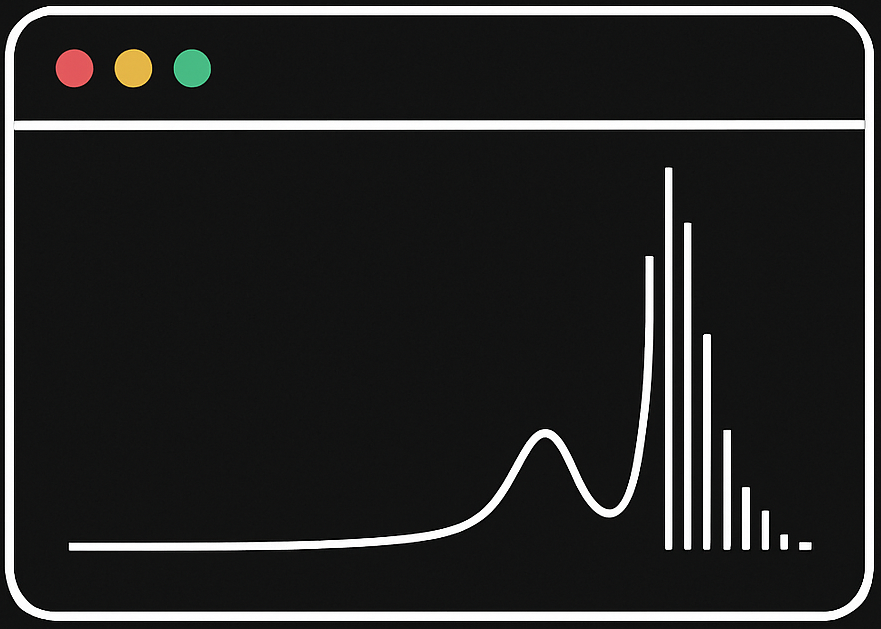

<h1>
  
  terminally_ASPIRED
</h1>


 A customisable, command-line-driven spectral reduction pipeline built around the [ASPIRED](https://github.com/cylammarco/ASPIRED) framework — tailored for data from the **SpUpNIC spectrograph** on the **SAAO 1.9m telescope**.
Designed for flexibility and reproducibility, `terminally_ASPIRED` combines robust automation with fine-grained user control via configuration files and interactive tools.
---

## ✨ Features

- Optional **bias and flat field correction**
- Fully configurable via a `defaults.json` file
- Interactive 2D trimming and live preview of spectrum extraction
- Custom **wavelength calibration** with user-defined atlas lines
- Built-in flux calibration and sensitivity inspection
- CLI wrapper for fast processing with reproducible configuration
- Automatic generation of final CSV output (science wavelength vs. flux) in [SNID](https://people.lam.fr/blondin.stephane/software/snid/) - ready format for fast extragalactic transient classification.

---

## 📦 Installation
### Recommended download
Create a new venv or conda env to avoid any conflicting dependencies. Package requires python version >=3.11

```bash
conda create -n SpectraPipeline python=3.11
```
```bash
conda activate SpectraPipeline
```
```bash
pip install --upgrade setuptools jmespath -i https://pypi.org/simple && \
pip install --index-url https://test.pypi.org/simple/ \
    --extra-index-url https://pypi.org/simple \
    terminally-ASPIRED
```


or a venv (ensure python version >= 3.11)

```bash
python3 -m venv ~/.venv/SpectraPipeline
```
```bash
source ~/.venv/bin/activate
```
```bash
pip install --upgrade setuptools jmespath -i https://pypi.org/simple && \
pip install --index-url https://test.pypi.org/simple/ \
    --extra-index-url https://pypi.org/simple \
    terminally-ASPIRED
```

Alternatively, follow the following steps making sure to clone the main branch

### Alternative download
### Step 1: Clone and Download

Download or clone this repository and ensure that you have the following key files:

- The pipeline class:`spectral_reducer.py`
- The command-line interface: `terminally_ASPIRED.py`
- The environment file: `environment.py`
- The `config_files` directory which should contain both `defaults.json` & `trim_bounds.json`

### Step 2: Set up Conda Environment

We recommend using a virtual environment:
```bash
conda env create -f environment.yml
conda activate SpectraPipeline
```

---
## ⚙️ Configuration: `defaults.json`
This file controls all pipeline behaviour.
Key sections include:
- **Trimming Bounds**(`trim_bounds`): pixel coordinates for cropping the 2D image
- **Cosmic ray cleaning**(`cosmic_ray`): parameters passed to AstroScrappy
- **Arc line atlas**(`arc_lines`): wavelengths for calibration.
- **Extraction parameters**(`extract_kwargs`): per-object optimal extraction.
- **Tracing config**(`trace_kwargs`): for locating spectrum traces.
- **Wavelength solution fitting** (`wavelength_cal`, `hough`)
---

## 🚀 CLI Usage
### Basic Usage 
```bash
python terminally_ASPIRED.py science.fits arc.fits standard.fits standard_arc.fits
```
### ⚙️ Required Arguments
| Argument            | Description                                          |
|---------------------|------------------------------------------------------|
| `science.fits`      | Path to the science target FITS file                 |
| `arc.fits`          | Path to the arc lamp FITS file for the science frame |
| `standard.fits`     | Path to the standard star FITS file                  |
| `standard_arc.fits` | Path to the arc lamp FITS file for the standard star |


### 🛠️ Optional Arguments
| Flag                      | Description                                                          | Default                      |
|---------------------------|----------------------------------------------------------------------|------------------------------|
| `--config`                | Path to JSON config file                                             | `config_files/defaults.json` |
| `-b`, `--bias`            | Path to directory with bias frames (skip if empty)                   | `""`                         |
| `-f`, `--flat-field`      | Path to directory with flat fields (skip if empty)                   | `""`                         |
| `-t`,`--interactive-trim` | Enable interactive trimming of 2D spectra                            | Off                          |
| `--show-plots`            | Show intermediate plots during reduction                             | Off                          |
| `-s`, `--smooth`          | Smoothing box size for final 1D spectrum                             | `1` (no smoothing)           |
| `-v`, `--verbose`         | Enable verbose output                                                | Off                          |
| `--no-warnings`           | Suppress warning messages                                            | Off                          |
| `-O`, `--output-dir`      | Custom output directory name (default: object name from FITS header) | `None`                       |
| `--show-sky`              | Show extracted sky spectrum in final plot                            | Off                          |

### ⚠️ Note on Image Reduction
Dark frame correction is not implemented. This is because the CCD used on the 1.9 m telescope is cryogenically cooled to temperatures around 170 K, rendering the dark current negligible or even potentially introducing extra noise.

---
## 📤 Output

---

## 🧪 Developer Notes
This pipeline is built on the excellent ASPIRED library by Marco Lam. terminally_ASPIRED wraps its lower-level functionality to streamline workflows, reduce bugs, and standardise output for further scientific use.

---
## ☄️Acknowledgements
Developed by Francois Campher and Lloyd Landsberg as part of our Masters' Dissertations. We aim to provide a useful tool for quick spectral reduction for the transients and variable stars research teams within the BlackGEM and MeerLICHT consortia, The University of Cape Town (UCT) and the South African Astronomical Observatory (SAAO). We would like to also thank the excellent developers of the RASCAL and ASPIRED packages.

---


